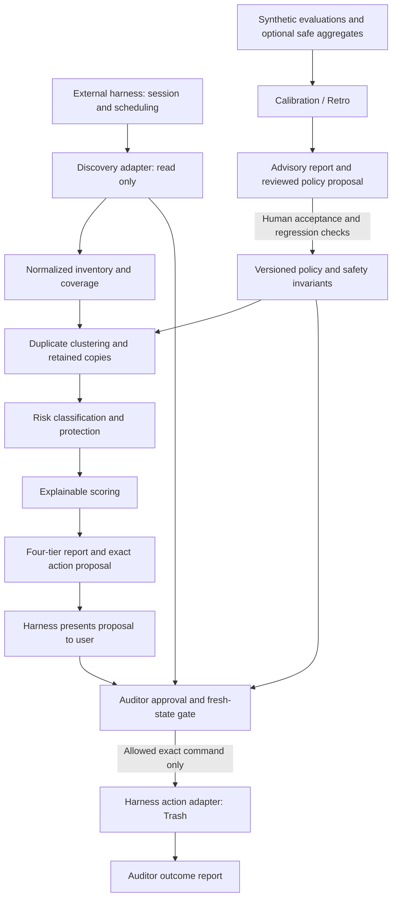

# Gmail Storage Auditor: v0.1 architecture

Scope: [GSA-001](https://github.com/tamiro44/gmail-storage-auditor/issues/1), competitive analysis and architecture only. Research checked on 2026-09-07. This document proposes contracts and verification requirements; it does not claim they are implemented. No product code, mailbox access, policy changes, or work on GSA-002+ is included.

## Decision and governing requirements

Build a reusable skill backed by a small, deterministic domain core and replaceable harness adapters. Start with one sequential audit workflow. The roles in [AGENTS.md](../AGENTS.md) describe responsibilities, not mandatory processes, services, or model calls.

**The harness may execute an action, but the Gmail Storage Auditor owns whether that action is allowed.**

[README.md](../README.md), [SKILL.md](../SKILL.md), [AGENTS.md](../AGENTS.md), and [config/policy.yaml](../config/policy.yaml) govern this design. Existing invariants remain mandatory:

- Analysis is read-only. No mailbox mutation, including labels or read state, belongs in analysis.
- No Trash or deletion action without explicit user approval for exact messages/actions in the current interaction. Prior audits, scheduled runs, silence, recommendations, and board status cannot supply approval.
- Scheduled audits produce reports only unless the user separately approves actions in the current interaction.
- Preserve at least one authoritative copy for every duplicate cluster selected for cleanup.
- Protect tax, legal, financial, medical, identity, employment, and signed records by default. The skill also protects contracts and other high-regret records; the shorter YAML list does not remove those protections. Sentimental media defaults to Review.
- Never commit or log real bodies, addresses, identifiers, attachment contents, credentials, tokens, or mailbox exports. Use synthetic fixtures and examples only.
- Deterministic evidence takes precedence over semantic inference. LLM classification is optional and explainable.
- Safety-sensitive behavior requires tests. Policy proposals require review; calibration cannot autonomously change policy or weaken safety gates.

Where metadata or configuration leaves protection uncertain, preserve the uncertainty and use Review or Keep. Do not interpret missing evidence as low risk.

## Competitive analysis

This is a primary-source comparison, not a hands-on benchmark. Capability and license descriptions come from the linked sources; reuse decisions and gaps are this project's architectural assessment of those documented capabilities. No upstream code is copied or dependency selected. Recheck the exact package/version license before future reuse; an OSS library license does not cover all associated hosted services.

| Project or established approach | License / availability | Reusable components and architectural ideas | Gaps for this auditor and decision |
| --- | --- | --- | --- |
| **Gmail native search and storage cleanup** — Gmail cleanup/auditing baseline | Proprietary Google service; no OSS implementation license offered by these help pages. | Reuse native search through a connector: size, age, and attachment queries provide inexpensive candidate discovery. Native manual cleanup establishes a useful baseline. [Search operators](https://support.google.com/mail/answer/7190?hl=en), [storage cleanup](https://support.google.com/mail/answer/6374270?hl=en). | The documented approach leaves retention decisions to the user; it does not specify this project's duplicate evidence, protected-category policy, or cumulative regret-aware ranking. Adopt discovery primitives, own the decision layer. |
| **gmailctl** — declarative Gmail management | [MIT](https://github.com/mbrt/gmailctl/blob/master/LICENSE). | Declarative filter configuration, query composition, tests, and a reviewable diff before application. Borrow the separation of policy, preview, and application. [Project documentation](https://github.com/mbrt/gmailctl). | Its focus is managing Gmail filters, including ongoing actions on incoming mail. That is a different approval scope from exact-message cleanup. No dependency or automatic filter installation in v0.1; reuse design ideas only. |
| **LangGraph** — agent orchestration | Core library: [MIT](https://github.com/langchain-ai/langgraph/blob/main/LICENSE). Hosted ecosystem terms are separate. | Stateful workflow execution, human oversight, and durable execution can implement an external runner. Borrow explicit stage transitions and pause/resume boundaries. [Project documentation](https://github.com/langchain-ai/langgraph). | Workflow state and checkpoints do not establish Gmail-specific permission. Persistence and tracing need privacy controls, and resuming must not revive approval from a prior interaction. Optional adapter candidate; no core dependency. |
| **AutoGen** — multi-agent orchestration | Code: [MIT](https://github.com/microsoft/autogen/blob/main/LICENSE-CODE); documentation/content: [CC BY 4.0](https://github.com/microsoft/autogen/blob/main/LICENSE). | Agent collaboration, tool adapters, and separation of runtime and application concerns provide orchestration ideas. [Project documentation](https://github.com/microsoft/autogen). | Multiple autonomous roles add cost and nondeterminism without replacing retention or authorization rules. The source currently reports maintenance mode, which adds adoption risk. Compare as an architectural reference; do not select as a v0.1 dependency. |
| **GitHub Issues + Projects** — board-based coordination | Proprietary hosted service; no OSS implementation license asserted for the service. | Issues remain work items; Projects offers table, board, and roadmap views with fields and automation. Reuse the existing issue workflow rather than building an agent board. [Projects documentation](https://docs.github.com/en/issues/planning-and-tracking-with-projects/learning-about-projects/about-projects). | A board coordinates development, not mailbox execution. Keep mailbox content and approval artifacts out of it. Use Backlog → Ready → In Progress → Review → Done for synthetic engineering evidence only; no new board is required. |

The smallest useful differentiation is explainable mailbox decisions and their safety constraints. Commodity search, credentials, runtime orchestration, and development boards stay external. A sequential harness can satisfy v0.1 without a multi-agent framework, database, vector store, or custom scheduler.

## Ownership boundary

| Concern | Gmail Storage Auditor owns | External harness / adapter owns |
| --- | --- | --- |
| Discovery | Search intent, coverage requirements, normalized metadata contract, handling missing evidence | Gmail authentication, API/tool mapping, pagination, read retries, rate limits |
| Decisions | Duplicate evidence, authoritative-copy logic, protected categories, uncertainty, scoring, tier assignment | Calling stages and supplying requested observations |
| Optional semantics | Permitted inputs, output validation, evidence provenance, conservative fallback | Model provider and invocation, if enabled under privacy constraints |
| Reporting | Reasons, retained-copy explanation, estimates, incremental tier totals, limitations | Rendering and showing exact messages privately to the user |
| Approval and actions | Exact action manifest, current-interaction approval validation, policy checks, revalidation, allow/deny decision | Authentic user interaction, session identity, secure message-reference mapping, executing only an allowed command |
| Operations | Domain failure semantics and adapter conformance requirements | Tool transport, scheduling, cancellation, resource limits, privacy-compatible session lifecycle |
| Evaluation / calibration | Synthetic expectations, metrics, advisory findings, policy-change proposals | Running evaluations or scheduling retrospectives; optional approved aggregate transport |
| Development coordination | Issue acceptance criteria, design decisions, review evidence | Existing issue/board platform and any agent task runner |

The approval UI is not the policy engine. A generic tool permission, an LLM's assertion of consent, or a runtime's ability to call Gmail is insufficient. The action adapter must enforce the auditor's gate at the final execution boundary. A harness that cannot prevent bypass, distinguish authentic current user approval, or meet privacy requirements is report-only (or unsuitable for private analysis if it logs inputs).

This contract assumes a conforming host; a document or skill prompt cannot constrain an independently malicious host holding Gmail credentials. Runtime integration must enforce the boundary and demonstrate it with synthetic conformance tests.

## Components and data flow

The core accepts ordinary structured records and returns records; contracts do not depend on a particular language, model, framework state object, transport, or connector brand. A harness may expose them through local calls, a CLI, or a tool protocol. v0.1 needs no network service of its own. Schemas and their implementations remain future issue work.

### Proposed data contracts

| Record / port | Minimum meaning and constraints |
| --- | --- |
| Audit context | Schema and policy versions, ephemeral run/account scope, inventory observation time, interactive or scheduled mode, supported capabilities, coverage and errors. Never contains credentials. |
| Inventory read port | Execute bounded discovery requests and fetch required metadata; return pagination/completeness, observation provenance, and explicit unavailable fields. Read operations cannot mutate mailbox state. |
| Message / attachment observation | Run-local opaque message/thread references; estimated message bytes; age; relevant state; attachment filename and exact bytes when available; derived direction/original-forward signals with provenance. Sensitive metadata is transient. Provider identifiers remain in the private adapter mapping. |
| Duplicate cluster | Members, evidence type and strength, contradictions, proposed authoritative retained references, and unresolved assumptions. Evidence is distinct from a confidence number. |
| Risk / recommendation | Protected-category findings, uncertainty, tier, confidence percentage with heuristic/calibration provenance, score components, reason codes, retained-copy references, and estimated reclaimable bytes. Unknown confidence must be visible rather than invented. |
| Report | Safe / Review / Aggressive / Keep candidates, private display resolution, coverage limits, evidence and retained safeguards, disjoint and cumulative estimated savings. |
| Action manifest | Immutable run/account/policy binding, exact message references, exact action (Trash only in v0.1), retained set, evidence snapshot and proposal revision. A query or thread reference cannot stand in for exact message selection. |
| Approval evidence | Authentic user selection tied to that manifest and the active interaction; explicit action and selected subset. Plain model-produced text or a bare approval boolean is insufficient. |
| Authorization result / action port | Deny with reasons, or a narrowly scoped command bound to the approved manifest and fresh checks. Adapter cannot expand the selection or substitute a different action. |
| Execution result | Per-message success, failure, or unknown outcome, followed by reconciliation when needed. Report completed actions separately from estimates; do not log raw provider errors containing personal data. |

Opaque references are transient linkage, not permission to persist private data. Real filenames, categories, subjects, identifiers, and free-text evidence must not enter repository artifacts, traces, checkpoints, or general-purpose logs. Resolve recognizable message details only in the private user interaction needed for review; do not duplicate them into a durable audit log. If the host cannot honor that distinction, do not use it for mailbox analysis.

### Domain behavior

1. **Inventory:** target large, old, attachment-heavy, sent, forwarded, and self-sent messages. Normalize overlapping results by message identity. Record search scope and incomplete pages; a targeted scan is not a complete mailbox inventory. Fetch further evidence only when needed. Absence from a partial result is not proof that a copy is absent or safe to remove.
2. **Cluster:** preserve the policy's strong signals (exact filename + exact byte size, original/forward thread relationship, self-sent retained-copy evidence) and weak signals (filename/subject similarity). Strong metadata is not collision-proof content identity. Similarity alone remains Review; uncertain authoritative retention prevents cleanup authorization. Content hashing could strengthen evidence later, but attachment downloads and hash storage are not required for v0.1.
3. **Protect:** classify before ranking. Protected records remain Keep or Review unless redundancy is proven and an authoritative copy remains, as the skill requires. A duplicate attachment does not establish that the whole message is redundant: unique text, other attachments, and context may still require retention. Missing context blocks a low-risk conclusion. Optional semantics may surface risk and reasons; it cannot supply duplicate proof, override protections, or authorize an action. Mailbox text is untrusted data, never operational instruction.
4. **Score:** use space, confidence, and risk as explainable inputs within eligibility constraints. The conceptual formula is not yet a numerical specification. Positive risk handling, confidence mapping, thresholds, and normalization require reviewed policy decisions; do not invent defaults here or allow raw size to override Keep. Deterministic tie-breaking and policy versioning enable reproducible synthetic evaluation.
5. **Report:** show estimated savings, confidence, risk, recommendation, reasons, and retained copy per candidate. Rank safe recovery first, then show the incremental cost/risk of Review and Aggressive and where further cleanup is questionable. Count each eligible message once across overlapping clusters and tiers; retained and Keep messages contribute zero proposed recovery. Missing sizes remain unknown, not zero-confidence precision.

Gmail exposes message-level `sizeEstimate` and separate message operations; attachment evidence must not be double-counted on top of whole-message estimates. [Gmail message resource](https://developers.google.com/workspace/gmail/api/reference/rest/v1/users.messages).

Moving to Trash is not immediate quota recovery: Trash continues to count toward storage until permanent removal. v0.1 reports potential recovery and confirmed moves separately, and does not empty Trash or permanently delete messages. The action adapter uses message-level Trash semantics. [Google storage guidance](https://support.google.com/mail/answer/6374270?hl=en), [Gmail Trash operation](https://developers.google.com/workspace/gmail/api/reference/rest/v1/users.messages/trash).

## Approval, execution, and failure behavior

Analysis ends with a report. Execution is an optional, separate path:

1. Construct and display an exact action proposal, including retained-copy safeguards and relevant uncertainty.
2. Receive explicit user approval of that proposal or an exact subset in the current interaction. Approval does not waive domain invariants. Changed actions, newly added messages, or a changed proposal require renewed approval.
3. Re-read target and retained-copy state immediately before execution. Verify the same account, active interaction, policy/evidence binding, approved membership, and authoritative retention across the entire selected set. A message retained for any selected cluster cannot also be selected for Trash through another cluster.
4. Deny or invalidate authorization if required state is unavailable, the retained copy is missing/in Trash, protection or evidence changed, the policy changed, or approval is stale. Recompute and seek approval for a materially changed proposal. Never choose a replacement retained copy silently after approval.
5. Issue only the allowed exact command to the harness action adapter. Check prerequisites before each operation; stop dependent operations on failure. No thread-wide mutation, dynamic search expansion, automatic fallback to permanent deletion, or unattended replay.
6. Reconcile timeout/unknown outcomes with read operations before considering a retry. Retry only within the same still-valid approval and after fresh gate checks; a restarted or later interaction needs fresh approval. Report partial results honestly.

Fresh reads reduce races but cannot promise an atomic mailbox snapshot or stop an independent client from deleting a retained message after validation. Minimize the interval, serialize dependent actions, stop on observed changes, and disclose this limitation. Do not claim transactional protection unsupported by the connector.

## Calibration / Retro Agent

Calibration is an advisory evaluation workflow outside the live approval/action path. The harness may schedule it, but the auditor defines the metrics, privacy rules, and meaning of findings. It has no action capability and no authority to change the active policy.

**Inputs:** versioned synthetic fixtures, expected classifications/retained copies, regression results, and historical synthetic score distributions. Optional real-audit feedback is limited to separately permitted, coarse aggregate counts such as approvals/rejections by broad recommendation pattern and policy version. No message/user identifiers, content, filenames, hashes, exact timestamps, free-text reasons, or linkable per-audit records are retained. Aggregation must suppress small or identifying groups; real feedback remains disabled until aggregation and minimum cohort rules are reviewed. Synthetic evaluations are sufficient for v0.1.

**Questions and measures:** false Safe recommendations, missed protected records, retained-copy violations (zero tolerated), false positives/negatives against synthetic expectations, confidence reliability, size dominance in ranking, and recurring approval/rejection patterns. Compare fixed fixture cohorts and policy versions; report sample sizes, missing feedback, and uncertainty. User approval is preference evidence, not proof that a duplicate was safe or that no regret occurred.

**Outputs:** a calibration report documenting evidence, limitations, drift or policy gaps, and recommended investigation. An optional policy-change proposal/PR specifies the old/new behavior, synthetic reproducer, expected benefit, risks, and regression requirements. Proposed new cases are fabricated from the failure pattern, never copied from real mail.

**Review loop:** Calibration proposes → Lead and relevant domain/Safety reviewers assess → Test responsibility supplies regression evidence → human maintainer accepts or rejects → accepted changes receive a new policy version. No autonomous edits, threshold tuning, live experiments, or weakened gates. New policy versions invalidate pending action proposals and do not retroactively authorize actions. Rejected proposals remain advisory evidence. This design does not initiate a calibration run or another issue.

## Verification requirements

GSA-001 verification is documentary: compare the design with the governing files, verify primary-source links and license scope, and map each acceptance criterion below. No product implementation or runtime test results are claimed. Future implementations must satisfy synthetic tests before their safety-sensitive behavior is considered Done.

| Future synthetic check | Required outcome |
| --- | --- |
| Analysis and scheduled audit with an instrumented adapter | No mailbox mutations; schedule supplies no approval. |
| Missing, forged, prior-interaction, wrong-account, changed-manifest, or replayed approval | Deny action; no invocation of the mutation port. |
| Same filename/size but conflicting content or uncertain authority | Strong metadata is recorded without treating it as proof; retain or require review. |
| Protected or sentimental content; optional model absent, failing, or requesting tools | Preserve protection/default Review; model output cannot authorize actions. |
| Shared retained message selected through another cluster; missing/trashed retained copy | Reject the conflicting selection or stale proposal. |
| Partial inventory, unknown sizes, overlapping discovery/clusters, unique content in a duplicate-attachment message | Visible uncertainty, no double counting, no unsupported redundancy conclusion. |
| Timeout, partial success, state changes, restart, or policy revision | Reconcile without blind replay; invalidate stale authorization. |
| Host logs/checkpoints/errors, model traces, calibration export | Synthetic sensitive canaries never appear in persisted artifacts; incompatible host is rejected. |
| Same observations and policy under two synthetic harness adapters | Equivalent core evidence, decisions, totals, and denials. |
| Calibration recommends relaxed policy or sparse real-feedback export | Proposal only; no active-policy change or identifying export. |

## Tradeoffs and open questions

| Decision | Benefit | Cost / limitation |
| --- | --- | --- |
| Sequential deterministic core; optional semantic classification | Reproducible decisions, smaller runtime surface, lower model dependence | Metadata uncertainty produces more Review/Keep results and less apparent recovery. |
| Harness-independent records and gate | Reusable across hosts; domain safety has one owner | Each adapter needs conformance evidence; prompts alone cannot enforce the boundary. |
| Transient private state and no mailbox-content logs | Preserves repository and runtime privacy invariants | Reduced debugging and durable resume; interrupted interactions need fresh evidence/approval. |
| Exact-message Trash only | Narrow, reviewable action scope | Whole-message context matters; no immediate quota recovery guarantee or attachment-only cleanup. |
| Human-reviewed calibration | Prevents feedback loops from silently changing policy | Slower adaptation and limited real-world evidence. |
| External board and orchestration | Avoids rebuilding commodity infrastructure | Host lifecycle, licensing, and capability differences remain integration concerns. |

Open questions for later reviewed design/implementation work, not new work started here:

- What additional deterministic evidence establishes authoritative retention and proven redundancy in each supported case? How should unavailable body context constrain eligibility?
- What confidence mapping, positive risk scale, tier thresholds, and size normalization should a reviewed scoring policy adopt?
- Which first connector can provide sufficiently fresh metadata, exact message actions, authentic session approval, and privacy-safe execution? What transport binds gate decisions to commands?
- What private session lifetime and race-detection capabilities can that connector guarantee?
- What aggregation/cohort rules and consent flow would make optional real feedback suitable for calibration?

These questions do not permit relaxing existing invariants. Until resolved, uncertainty remains visible and actions lacking sufficient evidence or approval remain denied.

## GSA-001 acceptance evidence

| Acceptance criterion | Evidence in this document |
| --- | --- |
| Compare at least four relevant projects/approaches | Five-row competitive analysis, including Gmail cleanup, agent orchestration, and board coordination. |
| Record license, reuse, ideas, and gaps | Comparison columns and primary-source links; hosted service and OSS license scopes distinguished. |
| Decide project vs external harness ownership | Ownership table and explicit auditor authorization boundary. |
| Propose harness-agnostic core | Component diagram, ordinary-record contracts, sequential workflow, adapter requirements. |
| Document in `docs/architecture.md` | This file. |
| Use no real mailbox data | Public documentation and repository guidance only; no mailbox access or real-data examples. |

Calibration integration, safety preservation, tradeoffs, and unresolved decisions are documented above. This completes the architecture deliverable for GSA-001 only; implementation and all other issues remain outside this change.
